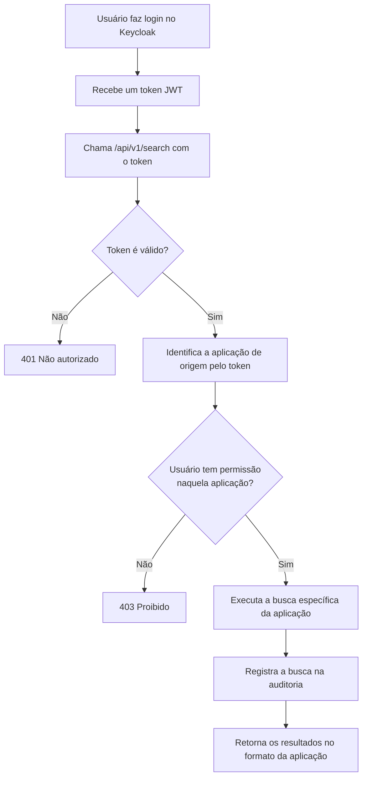

# Investigation Platform

Plataforma de inteligência investigativa distribuída, projetada para órgãos de controle,
compliance corporativo e investigações financeiras.

## O que é

A plataforma reúne **três aplicações** que compartilham um mesmo backend e um mesmo login:

- **Analytics** — relatórios analíticos, painéis e exportações.
- **Investigator** — grafos de relacionamento, linha do tempo e análise de vínculos.
- **Case Manager** — gestão de casos investigativos, atribuição de tarefas e fluxo de trabalho.

O usuário faz login **uma única vez** e acessa todas as aplicações às quais tem permissão
(SSO — Single Sign-On). Cada aplicação controla suas permissões de forma independente: dar ou
remover acesso a uma delas não afeta as outras.

O coração do sistema é um **endpoint de busca unificado** (`/api/v1/search`), compartilhado
pelas três aplicações, que se comporta de forma diferente conforme a aplicação de origem e as
permissões do usuário — buscando apenas nos dados pertinentes e registrando cada consulta para
auditoria.

## Como funciona uma busca (fluxo da requisição)



Cada aplicação retorna os dados no seu próprio formato: Analytics devolve dados agregados,
Investigator devolve dados completos, e Case Manager devolve apenas os metadados dos casos
atribuídos ao próprio usuário.

## Tecnologias

Python 3.12 · FastAPI · SQLAlchemy 2.0 · Alembic · PostgreSQL 16 · Keycloak (autenticação) ·
pytest · Docker.

## Como executar

Pré-requisitos: **Docker** e **Python 3.12** instalados.

### 1. Subir a infraestrutura (banco de dados e Keycloak)

```bash
docker-compose up -d
```

Isso sobe o PostgreSQL e o Keycloak. O Keycloak já vem **pré-configurado** (realm, aplicações,
permissões e um usuário de teste) por meio de um arquivo de importação — não é necessário
configurar nada manualmente.

### 2. Preparar o ambiente Python

```bash
python3 -m venv .venv
source .venv/bin/activate
pip install -e .
```

### 3. Configurar as variáveis de ambiente

Copie o arquivo de exemplo e ajuste se necessário:

```bash
cp .env.example .env
```

### 4. Criar as tabelas e popular dados de exemplo

```bash
alembic upgrade head
python scripts/seed.py
```

### 5. Rodar a aplicação

```bash
uvicorn app.main:create_app --factory --reload
```

A documentação interativa da API fica disponível em `http://localhost:8000/docs`.

## Como testar

A suíte de testes roda em modo *mock* (não depende do Keycloak no ar) e usa um PostgreSQL de
teste:

```bash
pytest
```

## Autenticação — teste rápido

A aplicação valida tokens emitidos pelo Keycloak. Para obter um token do usuário de teste e
fazer uma busca:

```bash
# 1. Obter um token (usuário de teste: investigador / test123)
curl -s -X POST http://localhost:8080/realms/plataforma/protocol/openid-connect/token \
  -d "grant_type=password" -d "client_id=analytics-api" \
  -d "client_secret=<SECRET_DO_CLIENT>" \
  -d "username=investigador" -d "password=test123"

# 2. Usar o access_token retornado para buscar
curl "http://localhost:8000/api/v1/search?q=relatorio" \
  -H "Authorization: Bearer <ACCESS_TOKEN>"
```

O usuário de teste tem acesso ao **Analytics** e ao **Investigator**, mas **não** ao Case
Manager — uma busca originada do Case Manager retorna `403`, demonstrando o controle de
permissão independente por aplicação.

Detalhes completos de autenticação (estrutura do token, modos `mock`/`keycloak`, validação via
JWKS) estão em [`docs/AUTENTICACAO.md`](docs/AUTENTICACAO.md).

## Estrutura do projeto

```
src/app/
├── main.py            # ponto de entrada da API
├── config.py          # configuração via variáveis de ambiente
├── db/                # modelos, sessão e repositórios (acesso a dados)
├── auth/              # validação de token, permissões, integração Keycloak
├── search/            # endpoint de busca, orquestração e estratégias por aplicação
└── audit/             # registro de auditoria das buscas
```

## Documentação técnica

- **Decisões de arquitetura** (por que cada escolha foi feita): [`DECISIONS.md`](DECISIONS.md)
- **Detalhes de autenticação**: [`docs/AUTENTICACAO.md`](docs/AUTENTICACAO.md)